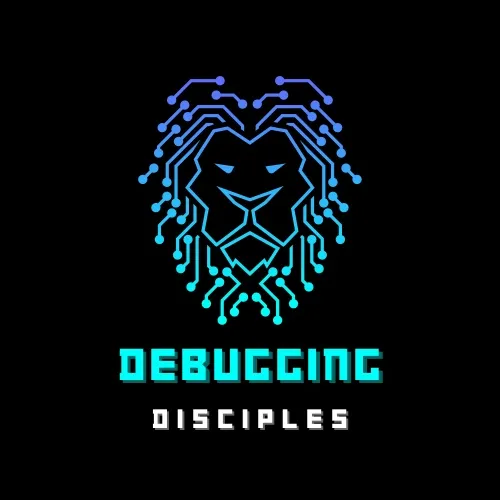

# Debugging Disciples

## About Us

**Debugging Disciples** is a welcoming, safe space where young Christian men in Computer Science can openly share challenges, find support, and grow together in faith and technology. Founded in February 2024, we are a brotherhood of believers committed to shaping the tech world through our shared values and expertise.

## Our Mission

*"Therefore encourage one another and build each other up, just as in fact you are doing."* — 1 Thessalonians 5:11

We believe that technology and faith can work hand in hand. Our community provides a platform where Christian men in the tech field can:

- Share their professional and personal challenges
- Find mentorship and guidance from fellow believers
- Grow spiritually while advancing in their careers
- Build meaningful relationships with like-minded individuals
- Make a positive impact in the technology industry

## Who We Are

Debugging Disciples is specifically designed for young Christian men pursuing or working in Computer Science and related technology fields. Whether you're a student just starting your journey, a recent graduate entering the workforce, or an experienced professional looking for community, you'll find a place here.

## What We Offer

### 🙏 **Bible Study Sessions**
Regular study sessions that explore how faith intersects with our professional lives in technology.

### 💬 **Community Support**
A safe space to share struggles, victories, and prayer requests with brothers who understand the unique challenges of the tech industry.

### 🎵 **Praise & Fellowship**
Curated playlists and opportunities for worship that resonate with our community's heart for both God and technology.

### 📖 **Testimonials**
Real stories from community members about how God has worked in their lives and careers.

## Join Our Community

We're always looking for new members who share our passion for both faith and technology. If you're a Christian man in Computer Science looking for community, support, and spiritual growth, we'd love to have you join us.

### How to Get Involved

1. **Visit our website** to learn more about our community
2. **Attend a Bible study session** to experience our fellowship firsthand
3. **Connect with other members** through our community platform
4. **Share your story** and contribute to our growing collection of testimonials

## Our Values

- **Faith First**: We believe that our relationship with God is the foundation of everything we do
- **Brotherhood**: We support and encourage one another through all of life's challenges
- **Excellence**: We strive for excellence in both our spiritual lives and our professional work
- **Service**: We seek to use our skills and talents to serve God and others
- **Growth**: We are committed to continuous learning and development in all areas of life

## Technology Stack

This website is built with modern web technologies:
- **React** with TypeScript for robust, type-safe development
- **Tailwind CSS** for responsive, modern styling
- **Vite** for fast development and building
- **Shadcn UI** for beautiful, accessible components

## Connect With Us

Ready to join our community of Christian technologists? Visit our website and take the first step toward meaningful fellowship and spiritual growth in the tech world.

---

*Building the future, one line of code and one prayer at a time.* 🙏💻
